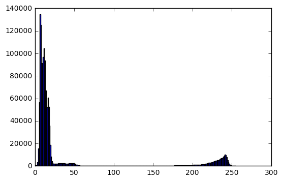
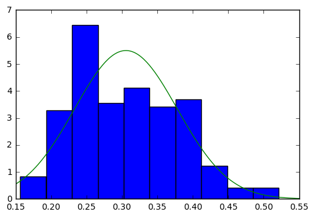
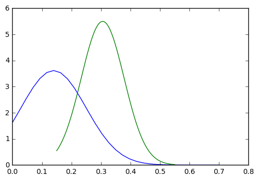
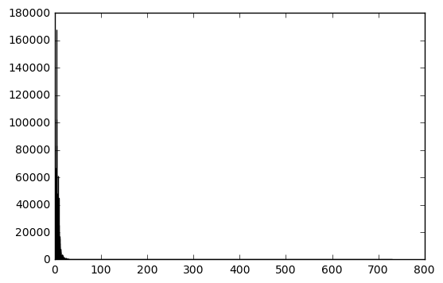
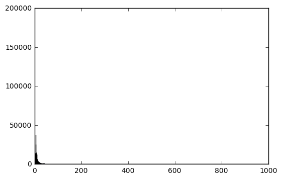
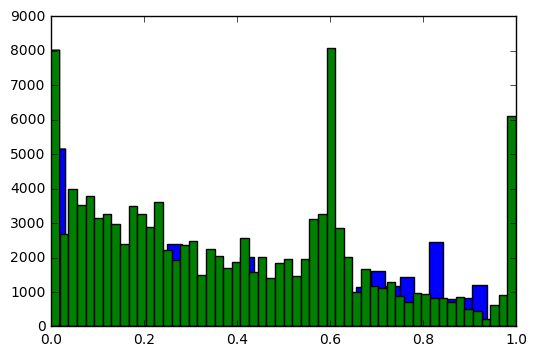

# Grayscale Classifying
The gray histogram is the gray scale version of the color histogram. It repre- sents the distribution of colors in an image, derived by counting the number of pixels of each of all gray intensity. The analysis of this histogram can give an estimation of the distribution of area having the same color/brightness.
* We compute the sum of difference between (neighbor) points of grayscale histogram (How smooth of the histogram is),one of the real images' grayscale histogram is shown below:

* Algorithm
Algorithm used in this project is focus on calculating the difference between the points in the histogram, and sum them together.This value is lower for natural images having a smooth gray histogram and higher for synthetic images having an histogram with more spikes:
1. Get the grayscale histogram of the images
2. Get the values of each bins, and normalized each value by dividing the value by the total number of pixels
3. Fit the guassian distribution on the histogram
* Alternative way:(directly choosing threshold without fit distribution):
  for i=0, i<256-1, i++ do
      smoothness+ = abs(grayHistogram[i] - grayHistogram[i + 1])
  end
4. Get the means and variance of the distribution and calculate the likelihood ratio
5. Get accuracy based on the threshold we choosing

* Result
False Positive rate:9%
True Positive rate (Probability of detection): 74%
# Appendix
Alternative Methods we've discussed:
* Gradient (Not accurate when compared with grayscale)
The image gradient is the vector $∇I = [I_{x}, I_{y}]^{T}$. The gradient magnitude is calculated by 
|∇I| = sqrt{I_{x}^2+I_{y}^2}
Computing the image derivatives can be done using discrete approximations. These are most easily implemented as convolutions: Ix = I * D_{x} and Iy = I * D_{y}.
Sobel filters:
D_{x} =[-1,0,1;-2,0,2;-1,0,1]
D_{y} =[-1,-2,-1;0,0,0;1,2,1]

* HSV: using saturation (Bad performance)

