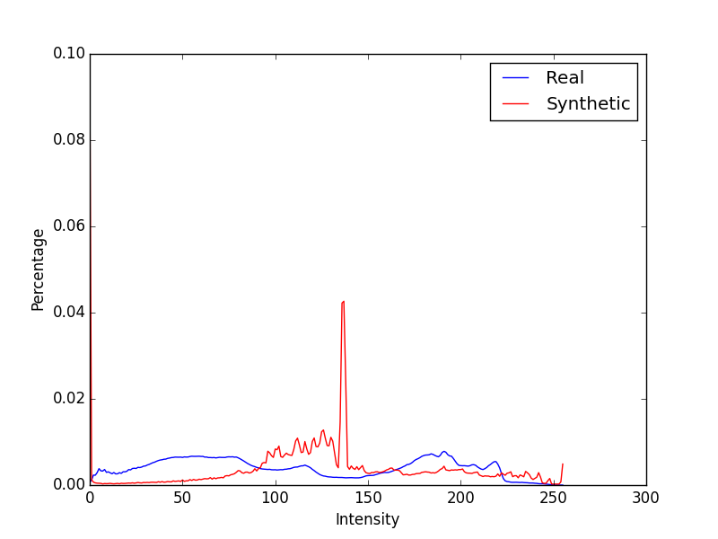
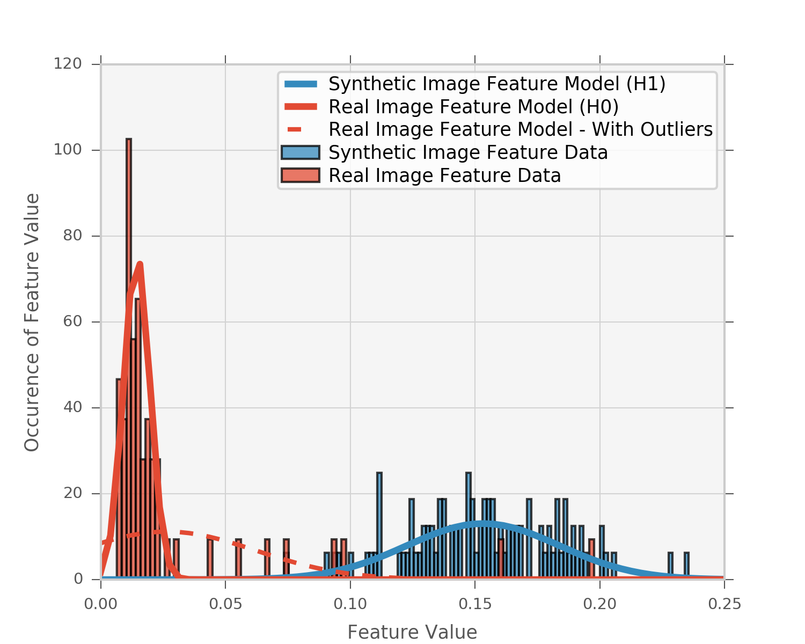

# Team Members
Viswam Nathan, Travis Taghavi, Daniel Whitten

# 1. Modeling

The problem was modeled as a binary hypothesis testing problem, with the observation being a set of pixels with RGB color information constituting an image. The two hypotheses were defined as follows:

* Hypothesis H0: The set of pixels constitutes a digital image of real life natural scenery
* Hypothesis H1: The set of pixels constitutes a computer generated image

We assume that there is some image-related feature alpha such that, the set of values that alpha assumes given H0 is true is distinguishable and seperable from the set of values that alpha assumes when H1 is true. The distributions of values that alpha assumes for each hypothesis will be established using the provided training data sets. We can then compare the probabilities P(alpha|H0) and P(alpha|H1) and choose the greater one to be the likelier hypothesis. This will require fitting distributions around the observed values of alpha from the training set and using these distributions as the basis to calculate the two probabilities mentioned earlier. Depending on the feature, a reasonable assumption could be that the distribution is normal and we can simply find the mean and variance of the set of values of alpha from each training set (scenery vs. computer generated) and fit Gaussian distributions with these parameters on the observed alpha values from each set.

The methods described here exhibit an equivalent structure to that of the log likelihood ratio, and we know that this structure is optimal for a binary hypothesis testing problem. Even though the provided training sets are lopsided, we assume that the priors for each hypothesis are equal and do not consider them as part of our algorithm.

# 2. Algorithm Structure

After trying a couple of image processing features, we settled on one that we thought had the right balance between computational efficiency and classification performance. The image is first converted to greyscale, and we then collect the respective intensity values of each pixel and create a histogram. This histogram is then normalized so that we now have, for each intensity bin, the percentage of the overall number of pixels that correspond to that intensity. Finally, the feature alpha is defined as the percentage of pixels comprised of the most common intensity value, i.e., the max value of the normalized histogram.

Shown below is a plot of the intensity histograms for a randomly chosen real and synthetic image:

Since the real image consists of more complex shading and textures, the distribution of pixel intensities is much more uniform than in the synthetic image, resulting in spikes in the synthetic image's distribution.
This is why we believe this feature to be a logical choice to create a model with.
So, the feature extracted from this real and synthetic image would be around 0.01 and 0.07, respectively.

This feature alpha is then computed for all the images in each of the two training data sets - real scenery and computer generated - so that we have distributions of alpha, f0 and f1, for each of the two hypotheses.
As alluded to before, we assume that the distribution of the percentage of most prevalent intensity in grayscale is Gaussian. Therefore, we calculate the mean and variance for each of the two distributions of alpha and fit two Gaussian waveforms around the observed alpha values from the two training sets.

For each image in the training set, the value of the feature was calculated.
A histogram of feature values was constructed for images in both the real image and synthetic image set.
A normal distribution can be fit to both sets.
The real image set has a significant peak around a feature value of 0.014.
However, the "tails" of this distribution are very long.
Fitting a normal distribution to all data points does not capture the peak around 0.014.
This distribution is shown with the dashed red line in the figure.
Instead, feature values greater than 0.04 were considered to be outliers in this data set and a new normal distribution solid red line) was fit to the inliers.

The PDFs for H0 and H1 then have the following parameters:

|         | H0           | H1  |
| ------------- |:-------------:| :-----:|
| Mean     | 0.0145 | 0.153 |
| Std     | 0.00528      |   0.0306 |

Then for each new testing image, we calculate the feature alpha and then find the probability of this alpha value with respect to the Gaussian distribution f0. This represents the likelihood L0 that H0 is the true hypothesis, P(H0 | alpha). Similarly, we calculate L1 using the distribution f1 and the same alpha value. A decision of H0 (real image) is returned when L0 > L1, else a decision of H1 (computer generated image) is returned.
This, of course, is assuming equal priors.

# 3. Code

Commented code is available in this directory. The file testim.py extracts the features from all the training images and stores them in separate csv files.
The file imDetect.py takes in a directory as an argument and outputs a csv file with its predictions.

# 4. Presentation of Results

When run on the original test sets, our detector correctly predicts 52/58 real images, and 99/99 synthetic images.
This translates to a 10.3% false alarm rate and a 100% detection rate.

We surmised that the misclassifications were as a result of images in the scenery data set that were overly dark, or had an unusually sparse color distribution such as the picture of the duck in water. Therefore we feel it is suitable to go with the model that excluded these as outliers and correctly identified all the synthetic images.

One notable weakness of this detector is that it will not correctly predict any synthetic images that have been equalized.
This is a very common image-processing technique to a achieve a desired level of contrast.
